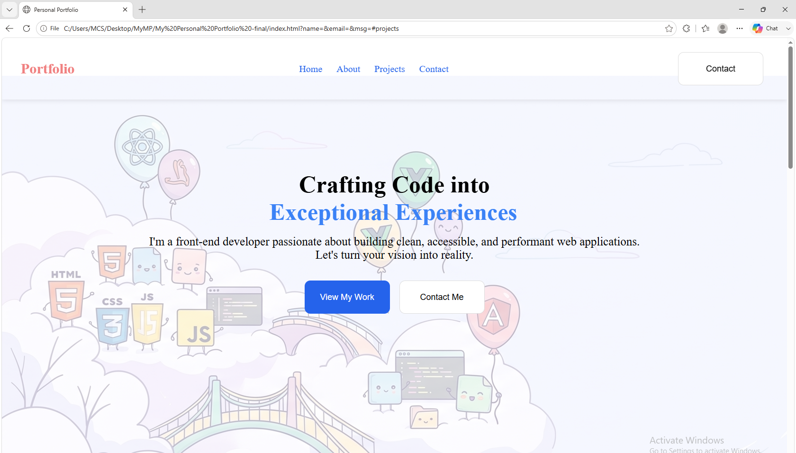
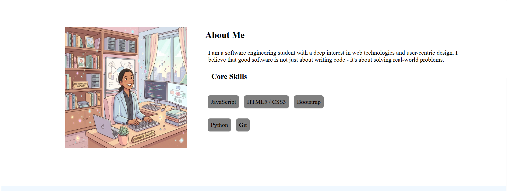
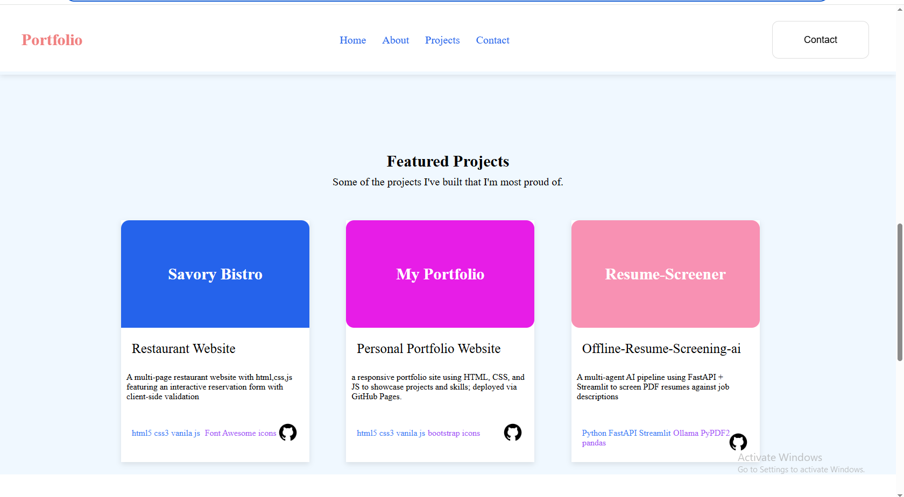
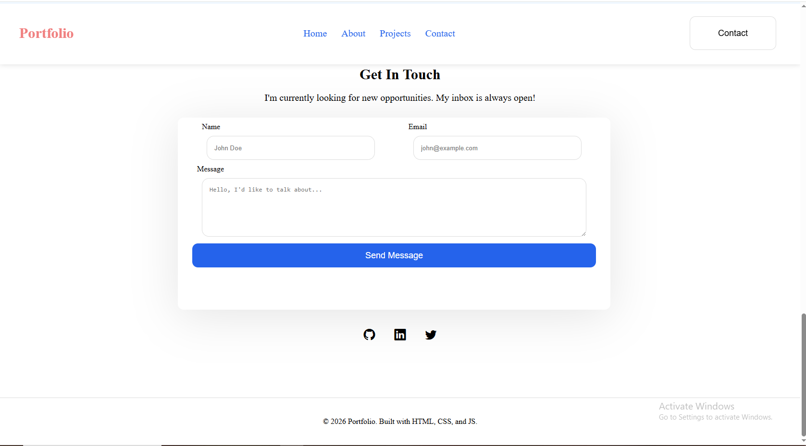

# My Portfolio

A personal portfolio website showcasing my projects, skills, and contact info.

🔗 **Live site:** https://Sudharshika.github.io/personal-portfolio/

## Project Structure
```
portfolio/
├── index.html
├── style.css
├── README.md
├── .gitignore
├── images/
│   ├── main-img.png
│   └── pic.png
└── demo/
    ├── home-page.png
    ├── about-page.png
    ├── projects-page.png
    └── contact-page.png
```

## Built With
- HTML5
- CSS3
- Vanilla JavaScript
- Bootstrap Icons

## Features
- Responsive navigation with smooth scroll
- Clickable project cards linking to live demos, with separate GitHub source links
- Contact form with client-side validation (demo — not yet connected to a backend)
- Direct email and LinkedIn contact links
- Hover animations and transitions

## Screenshots





## Running Locally
1. Clone the repo: `git clone https://github.com/Sudharshika/portfolio.git`
2. Open `index.html` in your browser — no build step needed

## What I'd Improve Next
- Connect the contact form to a real backend (e.g., Formspree or EmailJS)
- Make layout responsive for mobile (currently fixed-width in places)

## Contact
- LinkedIn: https://www.linkedin.com/in/sudharshika-mathimaran
- Email: sudharshika.mathimaran [at] gmail [dot] com